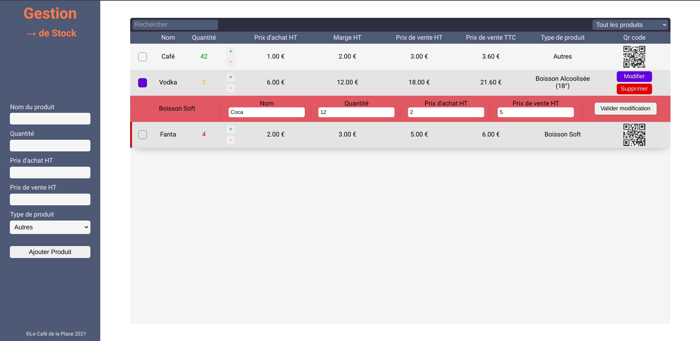

# cafe-place
> 2eme projet formation Bocal Academy JS Vanilla

***
## Objectifs:

    Maniupler le DOM
    Gérer les évènements
    Utiliser la POO
    Utiliser le LocalStorage

## Sujet: 

Le Café Place souhaite pouvoir gérer son stock depuis une application web sur l'ordinateur du comptoir. 
L'application doit proposer les fonctionnalité suivantes:

1. L'utilisateur doit pourvoir ajouter un nouveau produit dans le stock. 
Chaque produit doit comporter les caractéristiques suivantes, 

- Nom
- Quantité de produits
- Prix d'achat HT
- Prix de vente HT
- Marge HT (calculée automatiquement)
- Prix de vente TTC (calculé automatiquement)
- Type ("Boisson alcoolisée", "Boisson non alcoolisée", "Autre")
- Degré d'alcool (uniquement pour les alcools)

BONUS: Générer un QRCode pour chaque produit contenant sa référence.

***
## Ma stratégie :

* Une Barre latérale pour entrer les informations du produits
* Un affichage simple, ergonomique, et design
* un **code couleur pour les quantité**, une **fonction de modification à la volée des informations et du stock**
* une **fonction de recherche** pour améliorer l'éfficacité
* une **fonction de tri** des produits selon leurs types
* Utilisation d'une class abstraite Boisson et de 3 class qui extends Boisson
* Utilisation du **Local Storage pour stocker le tableau des produits**

